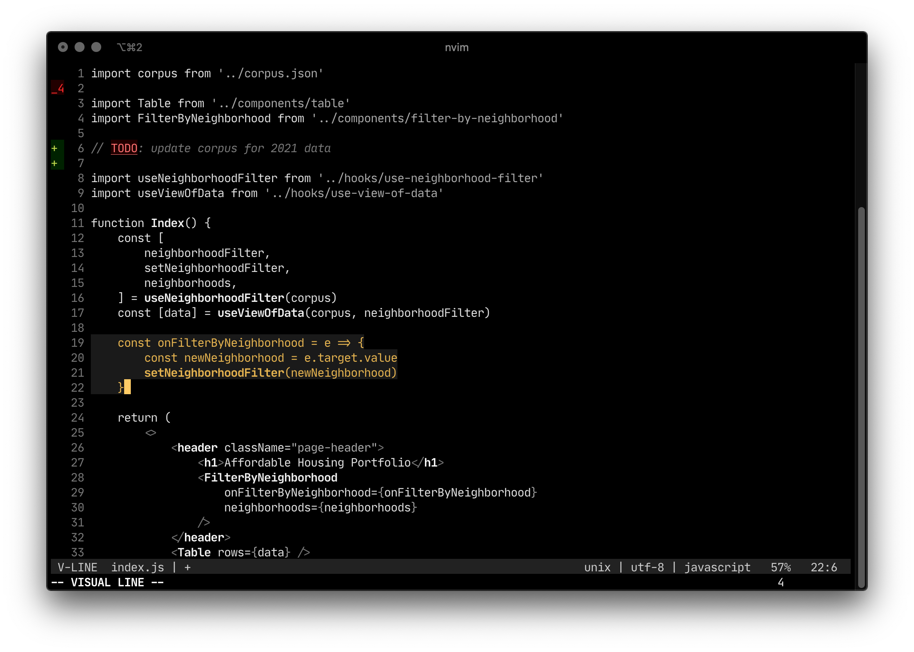

#  Zendo

### syntax highlighting with situational color

Zendo is a vim colorscheme that displays code monochromatically with situational highlights.
Search, parenthesis matching, TODOs, and diffs are colorful because they warrant extra attention.
Code has shades of gray and text formatting to mark syntax, but it's otherwise calm.

Zendo includes a [lightline theme](https://github.com/itchyny/lightline.vim) and some highlighting
for [vim-clap](https://github.com/liuchengxu/vim-clap).

## Installation

```
Plug 'liamdanger/zendo'
```

```
colorscheme zendo
```

## Screenshot


